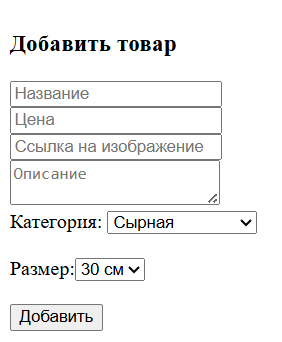
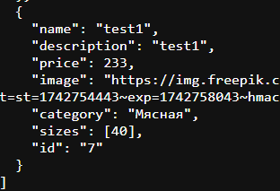
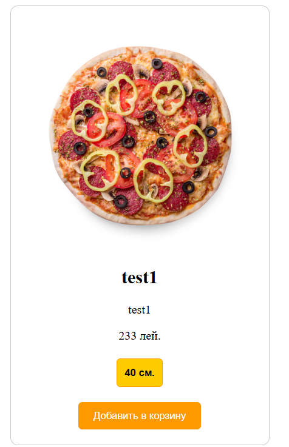

#ОТЧЕТ по лабе 5


### 1. Подготовка среды

**Что сделано:**
- Зарегистрирован проект на [mockapi.io](https://mockapi.io).
- Создан ресурс `products`, куда добавлены начальные данные.
- Получен базовый URL:  
  `https://67fbd1781f8b41c81684f5de.mockapi.io/api/v1/products`.

---

### 2. Загрузка данных с сервера и отображение товаров

**Ключевые фрагменты:**
```jsx
useEffect(() => {
  setLoading(true);
  fetch(API_URL)
    .then((res) => res.json())
    .then((data) => {
      setPizzas(data);
      setFilteredPizzas(data);
      setLoading(false);
    })
    .catch((error) => {
      console.error("Ошибка загрузки:", error);
      setLoading(false);
    });
}, []);
```

**Пояснение:**
- Используется хук `useEffect` — запрос на сервер при монтировании компонента.
- Используется `useState` для хранения данных (`pizzas`) и состояния загрузки (`loading`).
- Пока данные загружаются, отображается индикатор:

```jsx
{loading ? (
  <Skeleton height={200} />
) : (
  // отображение карточек
)}
```

**Библиотека:**  
Использован компонент `Skeleton` из `react-loading-skeleton` для эффекта "скелетона".

---

### 3. Форма добавления товара с валидацией

**Компонент:** `ProductForm.jsx`

**Пример валидации:**
```jsx
if (!name || !price || !imageUrl || !description || !size || !category) {
  setError("Пожалуйста, заполните все поля.");
  return;
}
```

**Пояснение:**
- Используются `useState` для каждого поля формы.
- Если пользователь не заполнил поля, отображается сообщение об ошибке под формой.




---

### 4. Отправка данных на сервер

**Фрагмент:**
```jsx
const res = await axios.post("https://67fbd1781f8b41c81684f5de.mockapi.io/products", newProduct);
onAdd(res.data);
```

**Пояснение:**
- Используется `axios` для выполнения POST-запроса.
- После успешного запроса, новый товар добавляется в список пицц с помощью `onAdd()`.

    
---

### 5. Поиск по товарам (дополнительное задание)

**Компонент:** `Search.jsx`

```jsx
const debouncedSearch = debounce((event) => {
  onSearch(event.target.value);
}, 300);
```

**Пояснение:**
- Ввод в поле поиска обрабатывается с задержкой 300 мс (debounce).
- Используется библиотека `lodash.debounce` для оптимизации.

**Поиск в `PizzaList.jsx`:**
```jsx
const handleSearch = useCallback(
  debounce((query) => {
    const filtered = pizzas.filter((pizza) =>
      pizza.name.toLowerCase().includes(query.toLowerCase())
    );
    setFilteredPizzas(filtered);
  }, 300),
  [pizzas]
);
```

---

### 1. **Что такое клиентская валидация и какова её роль в веб-приложениях?**
Клиентская валидация — это проверка данных, введённых пользователем, прямо в браузере (на клиентской стороне), до отправки на сервер. Например, если пользователь забыл ввести email или ввёл его неправильно, валидатор сразу покажет ошибку.

**Роль валидации:** она помогает улучшить пользовательский опыт, предотвращает отправку ошибок на сервер и ускоряет процесс, так как ошибки показываются сразу.

### 2. **Что такое API и как он работает?**
API (Application Programming Interface) — это набор правил, который позволяет программам общаться друг с другом. Например, веб-приложение использует API, чтобы отправить запрос на сервер и получить данные.

**Как работает API:** Клиент (например, веб-сайт) отправляет запрос на сервер через API, сервер обрабатывает запрос и возвращает ответ (например, данные о пользователе или товаре).

### 3. **Что такое REST API? В чём разница между понятием API и REST API?**
REST API — это особый тип API, который использует стандартные HTTP-методы (GET, POST, PUT, DELETE). Он обычно работает с данными в формате JSON.

**Разница:** Все REST API — это API, но не все API являются REST API. REST API следует конкретным правилам, например, использует методы HTTP для работы с ресурсами (данными).

### 4. **Как организовать загрузку данных с сервера при монтировании компонента?**
В React для загрузки данных с сервера при монтировании компонента используется хук `useEffect`. Этот хук позволяет выполнить запрос к серверу после того, как компонент отобразится.

**Пример:**
```jsx
import React, { useState, useEffect } from "react";

function ProductList() {
  const [products, setProducts] = useState([]);

  useEffect(() => {
    fetch("https://......../products")
      .then(response => response.json())
      .then(data => setProducts(data));
  }, []); 

```
